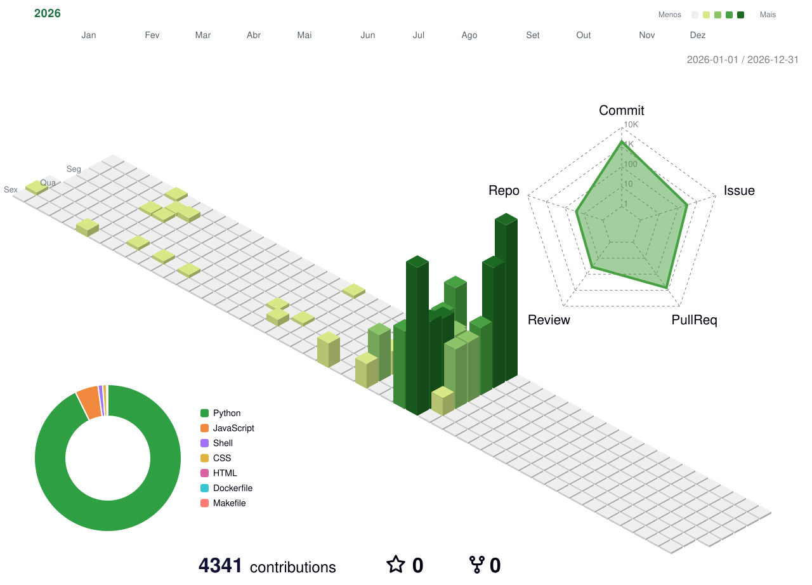

# pestoura

`@pestoura`

---

<picture>
  <source media="(prefers-color-scheme: dark)" srcset="./profile-3d-contrib/profile-2026-dark-v3.svg" />
  <source media="(prefers-color-scheme: light)" srcset="./profile-3d-contrib/profile-2026-light-v3.svg" />
  
</picture>

---

 
 

---

Graphics generated and committed automatically by GitHub Actions.

